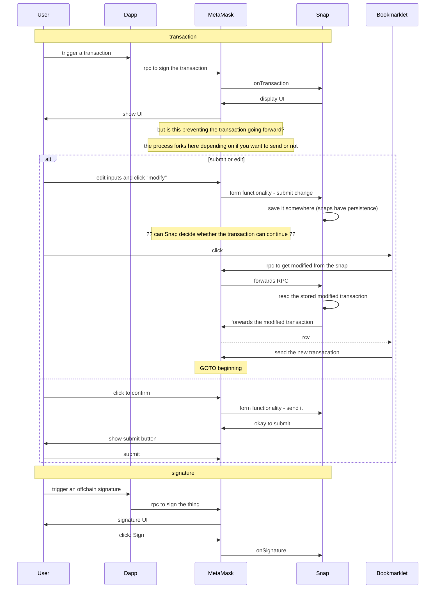

```mermaid
sequenceDiagram

participant U as User
participant D as Dapp
participant MM as MetaMask
participant S as Snap
participant B as Bookmarklet


Note over U,S: transaction

U->>D: trigger a transaction
D->>MM: rpc to sign the transaction
MM->>S: onTransaction
S->>MM: display UI
MM->>U: show UI
Note over MM: but is this preventing the transaction going forward?
Note over MM: the process forks here depending on if you want to send or not
alt submit or edit
    U->>MM: edit inputs and click "modify"
    MM->>S: form functionality - submit change
    S->>S: save it somewhere (snaps have persistence)
    Note over MM: ?? can Snap decide whether the transaction can continue ??
    U->>B: click
    B->>MM: rpc to get modified from the snap
    MM->>S: forwards RPC
    S->>S: read the stored modified transacrion
    S->>MM: forwards the modified transaction
    MM-->>B: rcv
    B->>MM: send the new transacation
    Note over MM: GOTO beginning
else
    U->>MM: click to confirm
    MM->>S: form functionality - send it
    S->>MM: okay to submit
    MM->>U: show submit button
    U->>MM: submit

end


Note over U,S: signature

U->>D: trigger an offchain signature
D->>MM: rpc to sign the thing
MM->>U: signature UI
U->>MM: click: Sign
MM->>S: onSignature

```